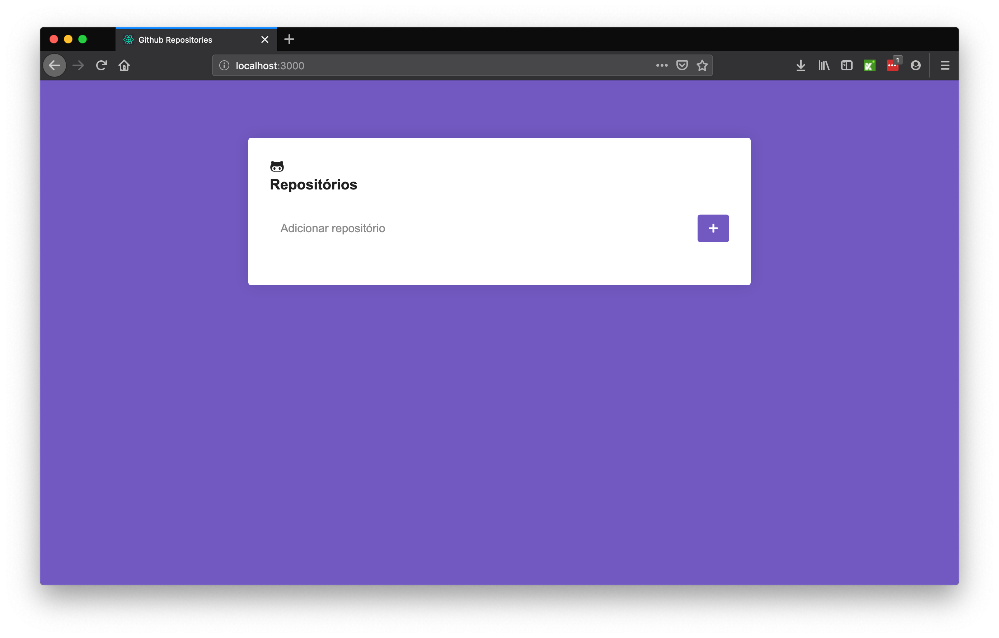
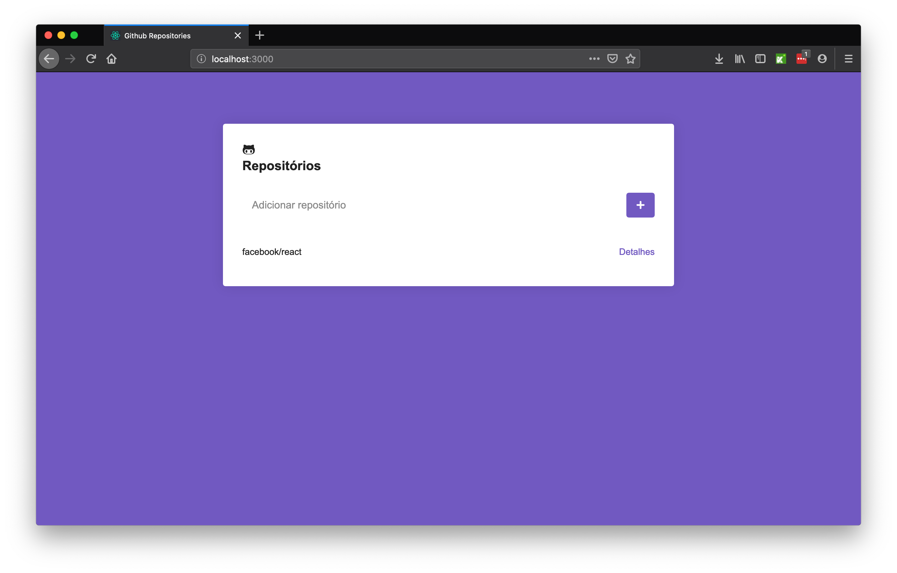
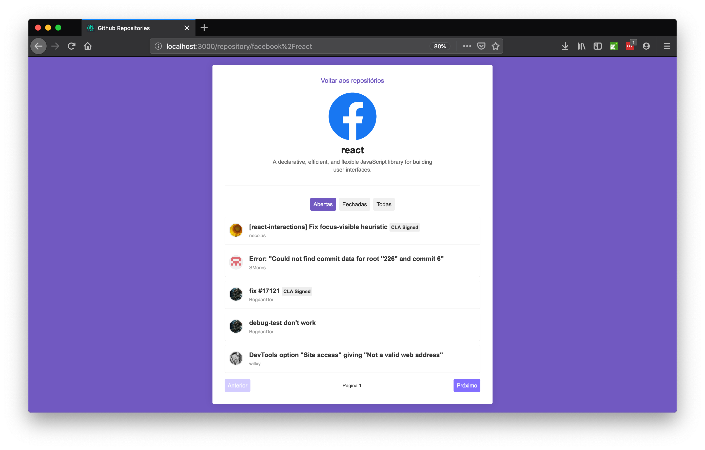
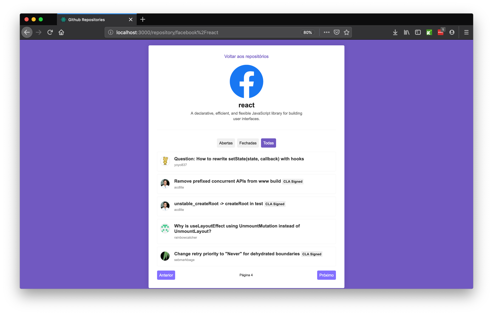

#Github Repositories

<h1>Desafio 05. Aplicação com ReactJS</h1>

## :computer: Web preview

- [x] Captando erros;

  > Adicione um try/catch por volta do código presente na função handleSubmit presente no componente Main e caso um repositório não seja encontrado na API do Github adicione uma borda vermelha por volta do input em que o usuário digitou o nome do repositório.

- [x] Repositório duplicado;

  > Antes de fazer a chamada à API na função handleSubmit faça uma verificação para ver se o repositório não está duplicado, ou seja, se ele ainda não existe no estado de repositories.
  > Caso exista, dispare um erro, e com isso o código cairá no catch do try/catch criado na funcionalidade anterior.

- [x] Filtro de estado;

  > Adicione um filtro de estado na listagem de Issues que criamos no detalhe do repositório. O estado representa se a issue está em aberto, fechada ou uma opção para exibir todas.

- [x] Paginação;

  > Adicione paginação nas issues listadas no detalhe do repositório. A API do Github lista no máximo 30 issues por página e você pode controlar o número da página atual por um parâmetro no endereço da requisição: "https://api.github.com/repos/rocketseat/unform/issues?page=2"

  > Adicione apenas um botão de próxima página e página anteior. O botão de página anterior deve ficar desativado na primeira página.

# :wrench: Running the project

- Yout need to set up all the reactJS enviroment.
- Clone this repository.
- Install all dependencies using the command `yarn`.
- Enter project directory and run `yarn start`.

# :fire: Used technologies

- ReactJS
- Styled Components
- State
- PropTypes
- REST service
- Other React and Node libs.
